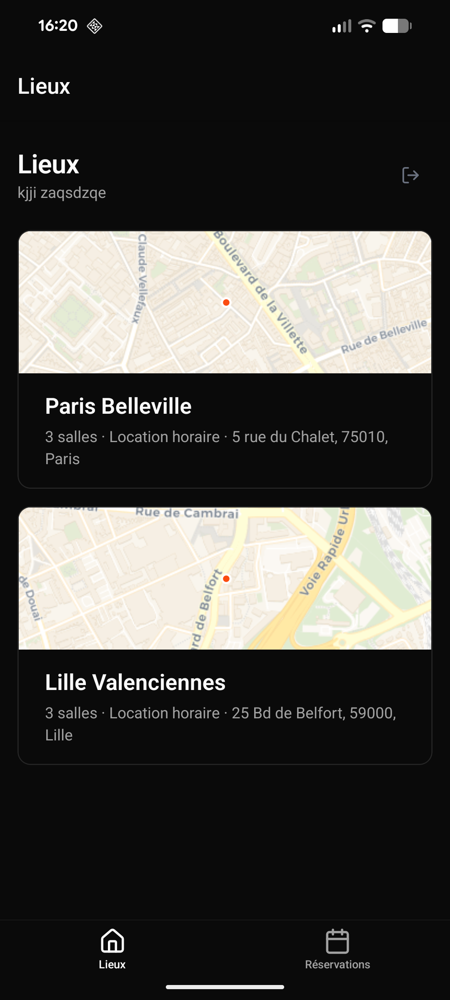
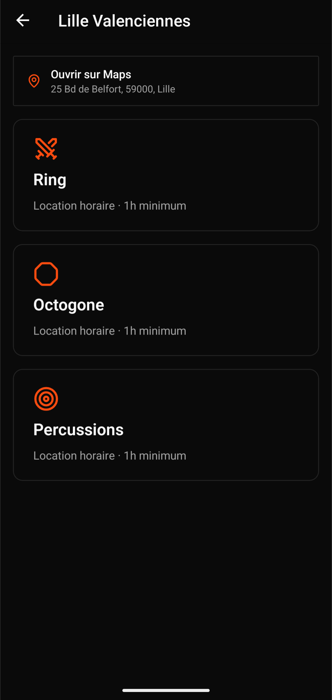
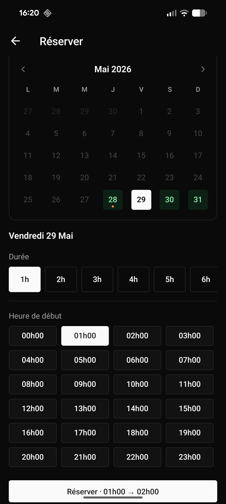
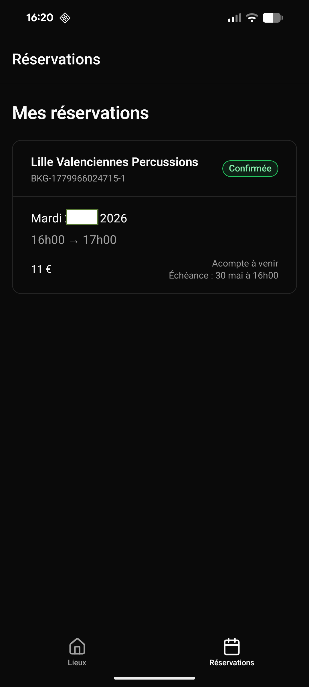
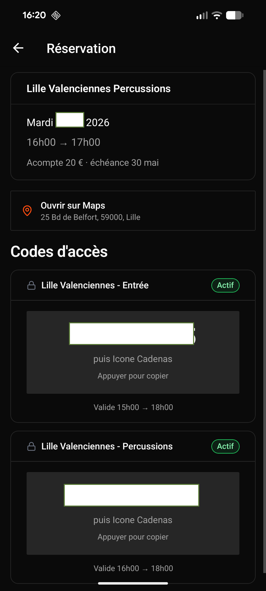

# Fight Room — Application mobile

Application compagnon non-officielle pour [fightroom.fr](https://fightroom.fr). Permet de consulter les lieux, réserver une salle de combat et gérer ses réservations depuis son téléphone.

> **Build Android :** [Télécharger sur Expo](https://expo.dev/artifacts/eas/vGAn6SgdixtXYufS625874.apk)
>
> 

---

## Aperçu

<table>
  <tr>
    <td align="center"><b>Lieux</b></td>
    <td align="center"><b>Salles d'un lieu</b></td>
    <td align="center"><b>Réservation</b></td>
    <td align="center"><b>Mes réservations</b></td>
    <td align="center"><b>Codes d'accès</b></td>
  </tr>
  <tr>
    <td></td>
    <td></td>
    <td></td>
    <td></td>
    <td></td>
  </tr>
</table>

---

## Fonctionnalités

- **Liste des lieux** — carte OSM intégrée par lieu, adresse, nombre de salles
- **Réservation** — calendrier, choix de durée et créneau, ajout au panier fightroom.fr
- **Réservations** — suivi des réservations à venir ; historique (terminées/annulées) accessible via toggle
- **Codes d'accès** — netcodes affichés et copiables depuis la réservation, avec statut traduit (Actif, Autorisé, Programmé…)
- **Ouvrir sur Maps** — lien direct vers l'adresse dans l'app Maps native
- **Annulation** — prévisualisation du remboursement avant confirmation
- **Session persistante** — reconnexion automatique silencieuse à l'expiration du JWT

## Stack

- [Expo](https://expo.dev) / React Native (SDK 54)
- [Expo Router](https://docs.expo.dev/router/introduction/) — navigation fichier
- [TanStack Query](https://tanstack.com/query) — cache et fetching
- [react-native-reusables](https://github.com/mrzachnugent/react-native-reusables) — composants UI (NativeWind)

## Lancer en local

```bash
bun install
bun run dev
```
